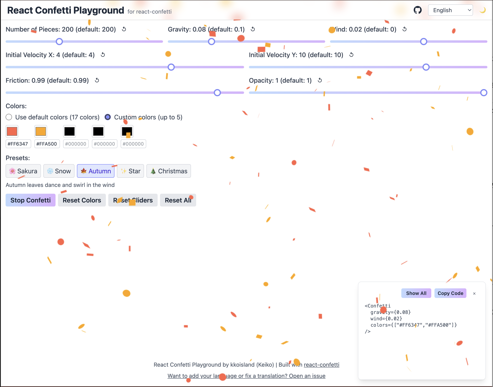

# React Confetti Playground

Interactive parameter playground for the [react-confetti](https://github.com/alampros/react-confetti) library. Tune animation parameters in real time, explore seasonal presets, and copy ready-to-use React code snippets.

🌐 **Live Demo:** https://www.kkoisland.com/react-confetti-playground/



## Features

- Real-time parameter tuning (gravity, wind, friction, opacity, velocity, number of pieces)
- 5 seasonal preset themes (Sakura 🌸, Snow ❄️, Koyo 🍁, Star ✨, Christmas 🎄)
- Custom color picker (up to 5 colors)
- Live code snippet generation with one-click copy
- 10-language UI (EN, JA, ZH, KO, ES, FR, DE, IT, NL, SV)
- Dark mode support
- Responsive layout

## Getting Started

```bash
git clone https://github.com/kkoisland/react-confetti-playground.git
cd react-confetti-playground
nvm use  # Node.js v22.21.1 specified in .nvmrc
pnpm install
pnpm dev
```

Open `http://localhost:5173` in your browser.

## Tech Stack

- **React**: 19.2.0
- **TypeScript**: 5.9.3
- **Vite**: 7.2.2
- **Tailwind CSS**: 4.1.17
- **react-confetti**: 6.4.0
- **react-intl**: 8.1.3 (i18n, 10 languages)
- **Biome**: 2.3.5 (linting and formatting)

## Project Structure

```
src/
├── App.tsx
├── Layout.tsx
├── main.tsx
├── index.css
├── pages/
│   └── PlaygroundPage.tsx
├── data/
│   └── themes.ts
└── i18n/
    ├── index.tsx
    └── locales/
        ├── en-US.json
        ├── ja-JP.json
        ├── zh-CN.json
        ├── ko-KR.json
        ├── es-ES.json
        ├── fr-FR.json
        ├── de-DE.json
        ├── it-IT.json
        ├── nl-NL.json
        └── sv-SE.json
```

## Author

**kkoisland (Keiko)**
- GitHub: [@kkoisland](https://github.com/kkoisland)

## Acknowledgments

Built with [react-confetti](https://github.com/alampros/react-confetti) by [@alampros](https://github.com/alampros).
